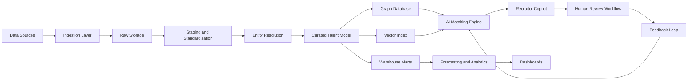
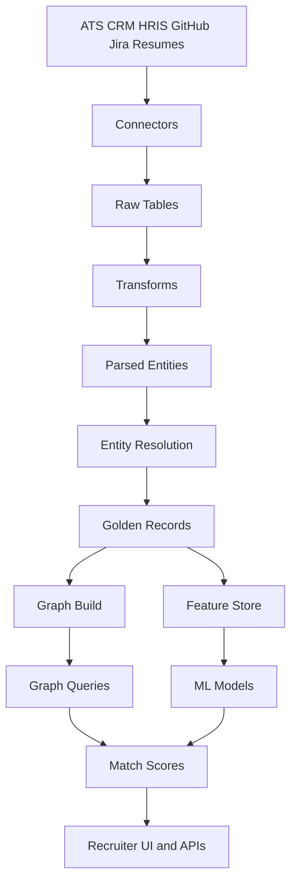
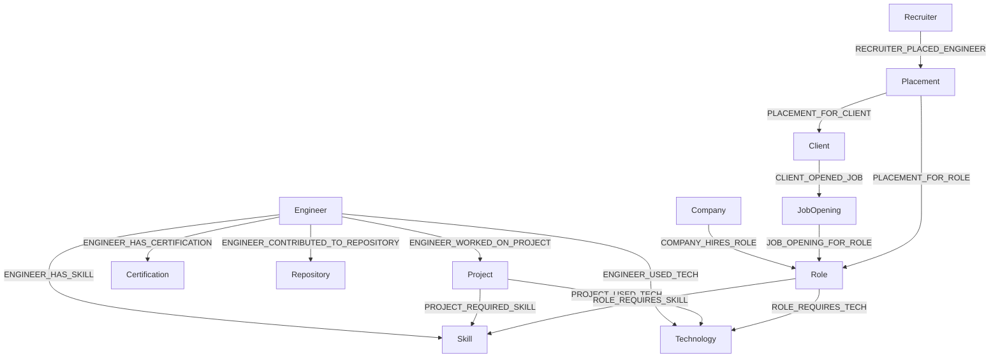

# IT Staffing Operating System Plan

This document captures the requested deliverables only:

1. Architecture plan
2. Repository tree
3. File creation plan

It does not generate the full implementation files yet.

## 1. Architecture Plan

### System Design

#### Data ingestion sources
- ATS and CRM systems such as Bullhorn, Greenhouse, Lever, Ashby, and Salesforce.
- HRIS and workforce platforms such as Workday, BambooHR, and Rippling.
- Resumes, recruiter notes, profile exports, and candidate submissions.
- Engineering activity sources such as GitHub, GitLab, Bitbucket, Stack Overflow, and package registries.
- Project and delivery systems such as Jira, Linear, Asana, and Monday.
- Client demand sources such as role intake forms, job orders, and sales pipeline systems.
- Certification and learning feeds such as Credly and LMS exports.
- Labor market and compensation benchmark data.

#### Entity resolution pipeline
- Land raw source records in a source-aware ingestion zone with timestamps and lineage.
- Standardize names, titles, locations, company names, technologies, and dates.
- Parse resumes and profiles with NLP to extract skills, certifications, projects, technologies, seniority, and domains.
- Run deterministic matching on hard identifiers such as email, handle, phone, and source-native IDs.
- Run probabilistic matching on name, work history, location, skill vectors, and company overlaps.
- Apply survivorship rules to create canonical golden records.
- Route low-confidence cases into manual review with confidence scores and evidence trails.

#### Talent graph model
- Use a property graph centered on Engineer, Skill, Technology, Project, Role, Company, Client, Job Opening, Recruiter, Placement, Repository, and Certification.
- Store relationship properties such as proficiency, recency, duration, source, confidence, and business outcome evidence.
- Support both operational search and strategic analytics over the same connected model.

#### AI matching system
- Use a hybrid architecture with filtering, semantic retrieval, graph-aware ranking, and explanation generation.
- Apply hard filters first for availability, location, authorization, compensation, and mandatory requirements.
- Use embeddings to retrieve engineers and projects relevant to a job opening.
- Rank candidates using skill coverage, depth of technology use, recency, similar placement history, domain experience, and recruiter feedback signals.
- Provide human-readable explanations for why each candidate is recommended.

#### Forecasting models
- Forecast demand by client, role family, geography, and skill cluster.
- Forecast talent supply by availability, location, seniority, and adjacent-skill pathways.
- Predict fill probability and time-to-fill.
- Estimate attrition, bench risk, and redeployment opportunities.
- Support scenario planning for future hiring and staffing demand.

#### Recruiter AI assistant
- Offer natural-language search across engineers, projects, and openings.
- Draft shortlists, candidate briefs, outreach messages, and submission summaries.
- Suggest adjacent-skill candidates and alternate talent pools.
- Surface rationale and confidence before any recruiter-facing action is finalized.

#### Analytics layer
- Provide dashboards for recruiter productivity, matching quality, staffing pipeline health, supply-demand imbalance, placement velocity, and margin.
- Publish analytics marts for historical trends and operational KPIs.
- Support graph analytics such as skill clusters, hidden experts, and talent community detection.

#### Governance and observability
- Enforce source-level data contracts and schema monitoring.
- Tag PII, mask sensitive fields, and apply role-based access control.
- Track lineage across ingestion, transformations, features, models, and AI outputs.
- Monitor freshness, data quality, pipeline failures, model drift, and bias indicators.
- Preserve audit logs for matching decisions and recruiter-facing AI outputs.

#### Human-in-the-loop review workflow
- Send uncertain entity resolution cases to review queues.
- Require human approval for AI-generated submissions and high-impact recommendations.
- Capture recruiter feedback on extracted skills, ranking quality, and shortlist usefulness.
- Feed review decisions back into continuous model improvement loops.

### Data Model

#### Conceptual model
- Engineer: person profile with work history, skills, technologies, certifications, availability, and compensation context.
- Skill: normalized capability such as Python, Data Modeling, or Platform Engineering.
- Technology: tool or platform such as AWS, Kubernetes, Snowflake, or React.
- Company: employer, staffing firm, or client-side organization.
- Project: delivery initiative with business domain, timeline, responsibilities, and outcomes.
- Role: normalized job archetype such as Data Engineer or Principal Platform Engineer.
- Certification: formal credential associated with an engineer.
- Repository: code repository linked to projects, technologies, and engineer activity.
- Placement: staffing assignment linking an engineer, recruiter, client, and role.
- Recruiter: internal staffing user responsible for sourcing and placement.
- Client: customer organization requesting talent.
- Job Opening: active hiring demand associated with a client and role.

#### Logical model
- Engineer has many Skills, Technologies, Projects, Certifications, and Repositories.
- Company hires many Roles and can employ many Engineers.
- Client opens many Job Openings.
- Role requires many Skills and Technologies.
- Recruiter manages Engineers and creates Placements.
- Placement connects Recruiter, Engineer, Client, Role, dates, rates, and outcomes.
- Project uses Technologies and requires Skills.

#### Physical model
- Raw, staging, curated, and analytics layers in a lakehouse or warehouse.
- Relational store for canonical operational entities and metrics.
- Graph database for relationships and explainable matching traversals.
- Vector index for semantic retrieval over resumes, project summaries, recruiter notes, and job descriptions.

#### Core graph relationships
- ENGINEER_HAS_SKILL
- ENGINEER_USED_TECH
- ENGINEER_WORKED_ON_PROJECT
- ROLE_REQUIRES_SKILL
- COMPANY_HIRES_ROLE
- RECRUITER_PLACED_ENGINEER
- PROJECT_USED_TECH
- PROJECT_REQUIRED_SKILL
- CLIENT_OPENED_JOB
- JOB_OPENING_FOR_ROLE
- ENGINEER_HAS_CERTIFICATION
- ENGINEER_CONTRIBUTED_TO_REPOSITORY

### Code Module Plan

#### Ingestion pipelines
- Source connectors, ingestion runners, validators, and checkpointing.

#### Graph construction
- Canonical node builders, edge builders, loaders, and graph feature jobs.

#### Skill extraction
- Resume parsing, JD parsing, taxonomy mapping, and proficiency inference.

#### Entity resolution
- Candidate identity stitching, company normalization, technology alias mapping, and golden record generation.

#### AI matching engine
- Filter service, retrieval service, ranker, explanation generator, and feedback capture.

#### Forecasting model
- Demand, supply, fill-time, and attrition model pipelines with backtesting.

#### Recruiter copilot agent
- Search, summarization, shortlist generation, outreach drafting, and approval workflow tools.

#### Observability and logging
- Structured logs, metrics, tracing, data quality checks, model telemetry, and alerting.

### Architecture Diagrams

#### System architecture


#### Data pipeline


#### Graph relationships


### Business Value
- Faster candidate matching through graph-aware ranking and semantic retrieval.
- Improved recruiter productivity through search, drafting, and shortlist automation.
- Better talent forecasting for demand spikes, time-to-fill, and skill shortages.
- Improved staffing pipeline visibility across recruiters, clients, openings, and placements.

## 2. Repository Tree

```text
it-staffing-operating-system/
├── .github/
│   └── workflows/
│       ├── ci.yml
│       └── deploy.yml
├── agents/
│   ├── recruiter_copilot/
│   │   ├── prompts/
│   │   ├── tools/
│   │   └── policies/
│   ├── matching_agent/
│   └── review_agent/
├── src/
│   ├── api/
│   │   ├── routes/
│   │   ├── schemas/
│   │   └── services/
│   ├── common/
│   │   ├── config/
│   │   ├── logging/
│   │   ├── utils/
│   │   └── constants/
│   ├── ingestion/
│   │   ├── connectors/
│   │   ├── parsers/
│   │   ├── loaders/
│   │   └── validators/
│   ├── transforms/
│   │   ├── cleaning/
│   │   ├── normalization/
│   │   ├── enrichment/
│   │   └── entity_resolution/
│   ├── orchestration/
│   │   ├── dags/
│   │   ├── jobs/
│   │   └── schedules/
│   ├── ml/
│   │   ├── features/
│   │   ├── embeddings/
│   │   ├── matching/
│   │   ├── forecasting/
│   │   ├── evaluation/
│   │   └── training/
│   ├── graph/
│   │   ├── builders/
│   │   ├── loaders/
│   │   ├── queries/
│   │   └── schemas/
│   └── tests/
│       ├── unit/
│       ├── integration/
│       └── e2e/
├── workflows/
│   ├── orchestration/
│   ├── data_quality/
│   └── human_review/
├── sql/
│   ├── schema.sql
│   ├── marts.sql
│   └── tests.sql
├── models/
│   ├── staging/
│   ├── intermediate/
│   └── marts/
├── notebooks/
│   ├── exploration/
│   ├── matching/
│   └── forecasting/
├── docs/
│   ├── ARCHITECTURE.md
│   ├── DATA_MODEL.md
│   ├── PIPELINES.md
│   ├── GRAPH_MODEL.md
│   ├── AI_MATCHING_ENGINE.md
│   ├── API_INTEGRATIONS.md
│   ├── GOVERNANCE.md
│   ├── OBSERVABILITY.md
│   ├── CI_CD.md
│   ├── SECURITY.md
│   ├── TESTING.md
│   ├── ROADMAP.md
│   ├── RUNBOOK.md
│   ├── USE_CASES.md
│   ├── RESULTS.md
│   ├── RESUME_BULLETS.md
│   ├── LINKEDIN_SUMMARY.md
│   └── PORTFOLIO_ENTRY.md
├── dashboards/
│   ├── recruiter_performance/
│   ├── talent_supply_demand/
│   ├── matching_quality/
│   └── executive_summary/
├── sample_data/
│   ├── resumes/
│   ├── job_openings/
│   ├── engineers/
│   └── projects/
├── infrastructure/
│   ├── terraform/
│   │   ├── modules/
│   │   ├── environments/
│   │   └── main.tf
│   ├── docker/
│   └── monitoring/
├── README.md
├── requirements.txt
├── .env.example
├── Dockerfile
└── .gitignore
```

## 3. File Creation Plan

### Root files
- README.md
- requirements.txt
- .env.example
- Dockerfile
- .gitignore

### Documentation
- ARCHITECTURE.md
- DATA_MODEL.md
- PIPELINES.md
- GRAPH_MODEL.md
- AI_MATCHING_ENGINE.md
- API_INTEGRATIONS.md
- GOVERNANCE.md
- OBSERVABILITY.md
- CI_CD.md
- SECURITY.md
- TESTING.md
- ROADMAP.md
- RUNBOOK.md
- USE_CASES.md
- RESULTS.md
- RESUME_BULLETS.md
- LINKEDIN_SUMMARY.md
- PORTFOLIO_ENTRY.md

### CI/CD
- .github/workflows/ci.yml
- .github/workflows/deploy.yml

### SQL
- sql/schema.sql
- sql/marts.sql
- sql/tests.sql

FILES TO REVIEW FIRST
