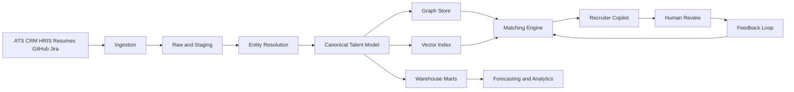

# Architecture

## Overview

`it-staffing-operating-system` is an AI-powered talent intelligence platform for IT staffing firms and engineering organizations. It combines operational data pipelines, a property graph, vector retrieval, ranking models, and recruiter-facing copilots to improve hiring velocity and staffing quality.

## System Layers

### Ingestion layer
- ATS and CRM connectors for candidate, client, and job opening records.
- HRIS and staffing workflow feeds for assignment and recruiter activity.
- Resume, recruiter notes, and job description parsers for unstructured content.
- Engineering signals from GitHub and project management systems.

### Standardization and resolution layer
- Normalize titles, companies, skills, technologies, locations, and dates.
- Resolve duplicate engineers, companies, repositories, and projects into canonical records.
- Persist confidence scores and evidence for each merge decision.

### Intelligence layer
- Relational warehouse for curated operational entities and marts.
- Postgres stored procedures for match scoring, queue routing, and graph-edge refresh jobs.
- Property graph for talent relationships and explainable traversals.
- Vector index for semantic similarity across resumes, projects, and job descriptions.
- Feature generation pipelines for matching and forecasting models.

### Decisioning layer
- AI matching engine with filtering, retrieval, ranking, and explanation steps.
- Forecasting services for talent supply, demand, time-to-fill, and bench risk.
- Recruiter copilot for search, shortlist generation, outreach drafts, and candidate summaries.

### Governance and operations
- Data quality checks, lineage, access control, PII protection, and audit trails.
- Logging, metrics, tracing, model monitoring, and review workflow telemetry.
- Managed cloud surfaces for operating teams through AWS console, QuickSight, CloudWatch, Step Functions, and EventBridge.

## Cloud Deployment Posture

- `Amazon RDS for PostgreSQL`: canonical operational store, marts, and PL/pgSQL matching workflows
- `Amazon ECS Fargate`: FastAPI services and batch workers
- `AWS Step Functions`: orchestrated matching, review, and graph refresh workflows
- `Amazon EventBridge`: connector schedules and event routing
- `Amazon S3`: raw resumes, ATS payload archives, and evaluation artifacts
- `Amazon OpenSearch`: semantic retrieval and hybrid search
- `Amazon Bedrock`: recruiter copilot summarization and drafting
- `Amazon QuickSight`: recruiter, operations, and executive dashboards
- `Amazon CloudWatch`: logs, metrics, alarms, and runbook triggers
- `AWS Secrets Manager`: connector and model secrets

## Mermaid System Diagram

