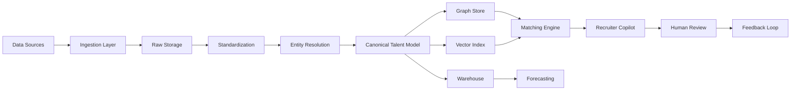

# Architecture Plan

This document summarizes the production design for the AI-powered IT Staffing Operating System.

## Platform Layers
- Ingestion layer for ATS, CRM, HRIS, engineering systems, resumes, certifications, and labor market feeds.
- Standardization and entity resolution layer for canonical talent records.
- Intelligence layer combining graph storage, vector retrieval, and ML feature generation.
- Operational AI layer for matching, forecasting, and recruiter copilot workflows.
- Analytics and governance layer for dashboards, observability, policy, and auditability.

## Core Capabilities
- Real-time graph of engineers, skills, technologies, companies, projects, recruiters, and openings.
- Hybrid AI matching with filters, semantic retrieval, graph-aware ranking, and explainability.
- Demand and supply forecasting for roles, geographies, and skill clusters.
- Human-in-the-loop workflows for low-confidence entity resolution and recruiter approvals.

## Mermaid Diagrams

### System architecture

