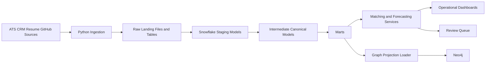
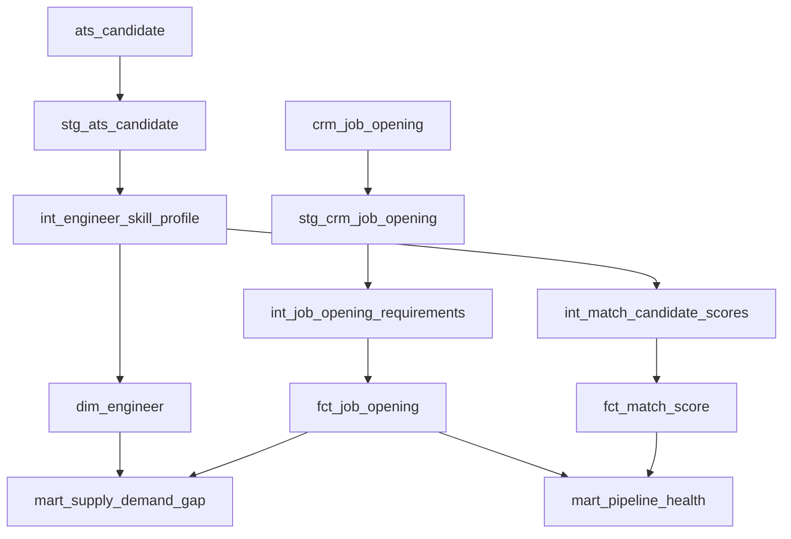

# Diagrams

## Data Flow

```mermaid
flowchart LR
    A[ATS CRM Resume GitHub Sources] --> B[Python Ingestion]
    B --> C[Raw Landing Files and Tables]
    C --> D[Snowflake Staging Models]
    D --> E[Intermediate Canonical Models]
    E --> F[Marts]
    F --> G[Matching and Forecasting Services]
    F --> H[Graph Projection Loader]
    H --> I[Neo4j]
    G --> J[Operational Dashboards]
    G --> K[Review Queue]
```

## Warehouse Lineage

```mermaid
flowchart TD
    ats_candidate --> stg_ats_candidate --> int_engineer_skill_profile --> dim_engineer
    crm_job_opening --> stg_crm_job_opening --> int_job_opening_requirements --> fct_job_opening
    int_engineer_skill_profile --> int_match_candidate_scores --> fct_match_score
    fct_job_opening --> mart_pipeline_health
    fct_match_score --> mart_pipeline_health
    dim_engineer --> mart_supply_demand_gap
    fct_job_opening --> mart_supply_demand_gap
```
