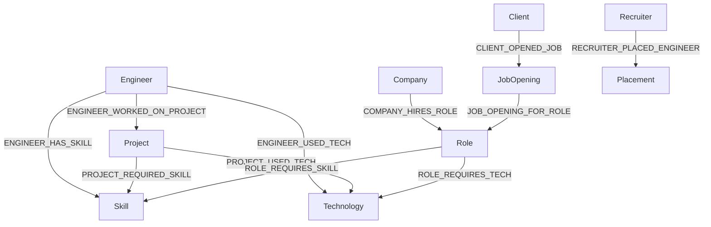

# Graph Model

## Node Types
- Engineer
- Skill
- Technology
- Company
- Project
- Role
- Certification
- Repository
- Placement
- Recruiter
- Client
- JobOpening

## Important Edge Types
- `ENGINEER_HAS_SKILL`
- `ENGINEER_USED_TECH`
- `ENGINEER_WORKED_ON_PROJECT`
- `PROJECT_USED_TECH`
- `PROJECT_REQUIRED_SKILL`
- `ROLE_REQUIRES_SKILL`
- `ROLE_REQUIRES_TECH`
- `COMPANY_HIRES_ROLE`
- `CLIENT_OPENED_JOB`
- `JOB_OPENING_FOR_ROLE`
- `RECRUITER_PLACED_ENGINEER`

## Mermaid Graph

